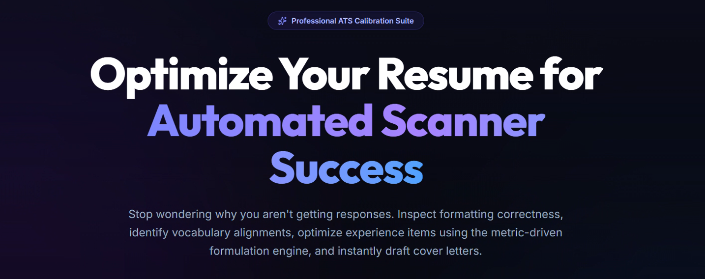
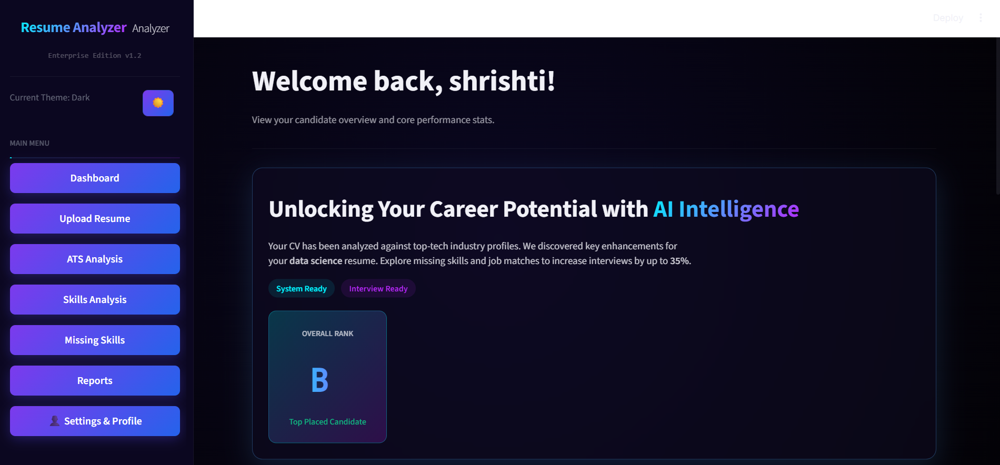
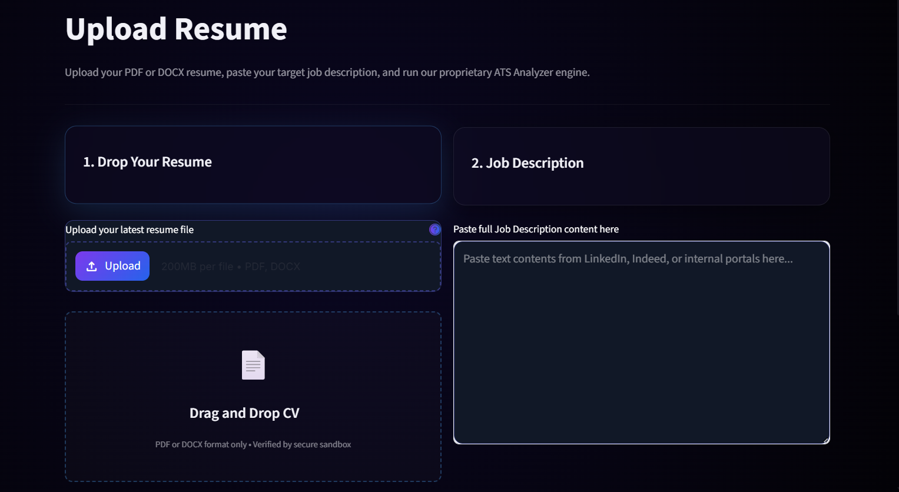
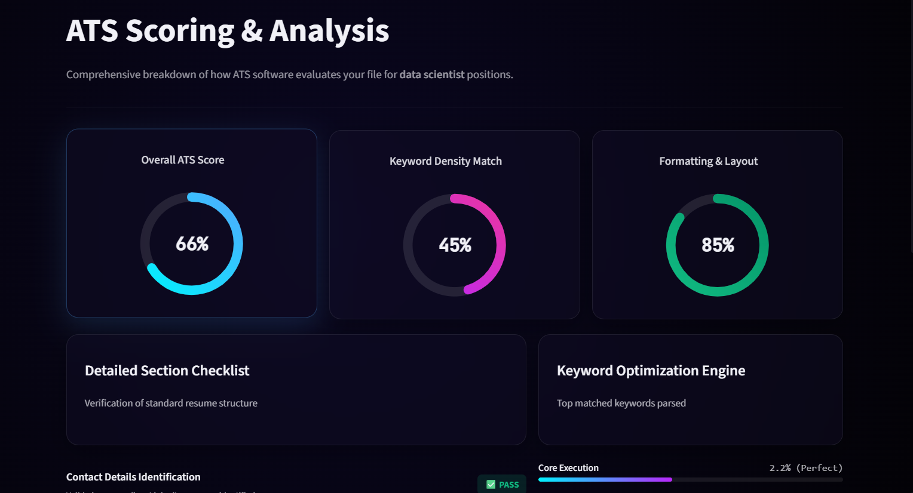
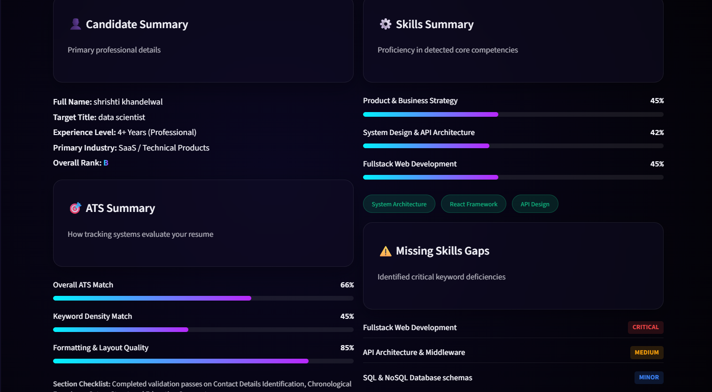
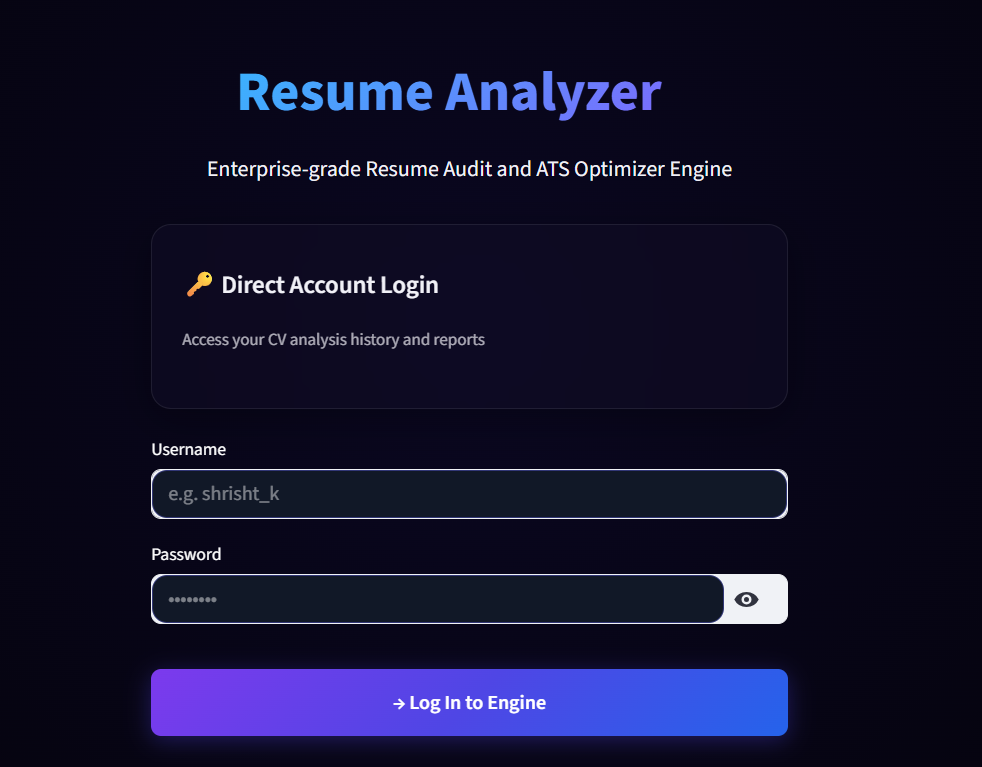

<p align="center">
  
</p>

<h1 align="center">AI Resume Analyzer</h1>

<p align="center">
  A modern AI-powered ATS Resume Analyzer built completely using Python & Streamlit.
</p>

---
## File Structure

AI-Resume-Analyzer/

├── app.py

├── components/

├── utils/

├── styles/

├── database/

├── assets/

|── screenshots/

├── requirements.txt

└── README.md

## Features

- ATS Resume Scoring
- Skills Analysis
- Missing Skills Detection
- Resume Upload (PDF/DOCX)
- Dynamic Dashboard
- Authentication System
- Dark Glassmorphism UI
- Candidate Profile Insights
- Downloadable Reports
- Modern SaaS Inspired Design

# Features description

## Dashboard

<p align="center">
  
</p>

- Modern SaaS dashboard UI
- Dynamic ATS analytics
- Candidate overview
- Skills insights
- Performance tracking

---

## Resume Upload

<p align="center">
  
</p>

- PDF/DOCX upload
- Drag & drop upload system
- Job role targeting
- Job description analysis
- Dynamic AI processing

---

## ATS Analysis

<p align="center">
  
</p>

- ATS match scoring
- Keyword analysis
- Resume optimization
- Match percentage
- AI-powered evaluation

---

## Skills Analysis

<p align="center">
  
</p>

- Technical skills breakdown
- Skill proficiency analysis
- Dynamic progress tracking
- AI-generated insights

---

## Missing Skills Detection

- Missing keyword detection
- Critical skills identification
- Resume gap analysis
- ATS optimization suggestions

---

## Reports

<p align="center">
  
</p>

- Candidate summary reports
- ATS report generation
- Downloadable PDF reports
- Clean analytics overview

---

## Authentication System

<p align="center">
  
</p>

- Login & Signup system
- User session management
- Secure authentication
- Profile handling

---

# Tech Stack

- Python
- Streamlit
- SQLite
- scikit-learn
- Plotly
- Pandas
- Custom CSS

---

# Installation

```bash
git clone https://github.com/shrishtikhandelwal19/AI-Resume-Analyzer.git
cd AI-Resume-Analyzer
pip install -r requirements.txt
streamlit run app.py
## Tech Stack

- Python
- Streamlit
- SQLite
- scikit-learn
- Pandas
- Plotly
- Custom CSS

## Project Structure

```bash
app.py
components/
utils/
styles/
database/
assets/
